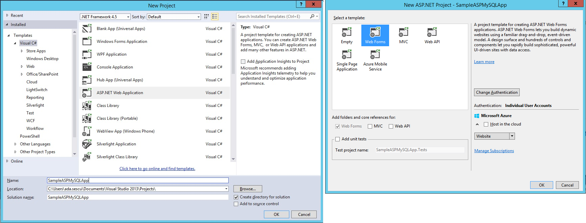
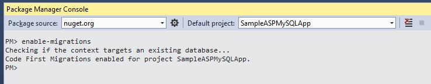
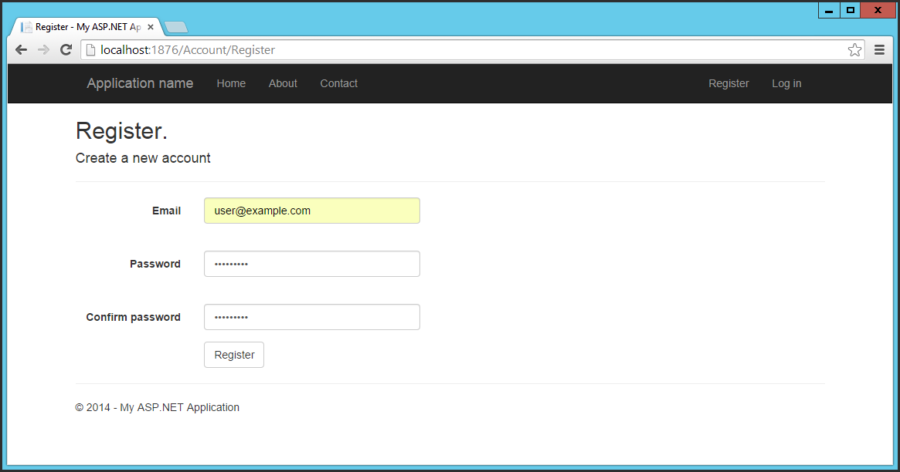
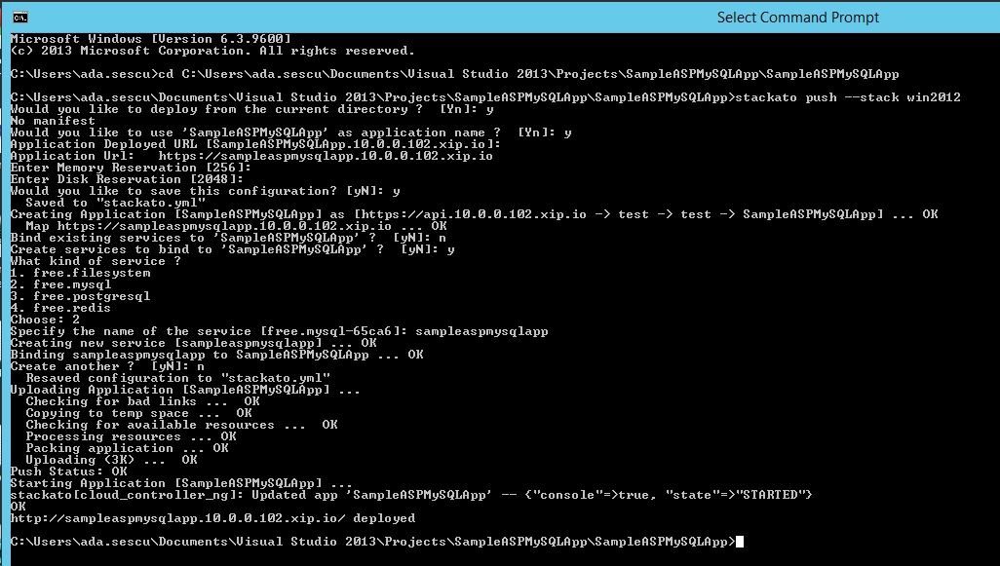
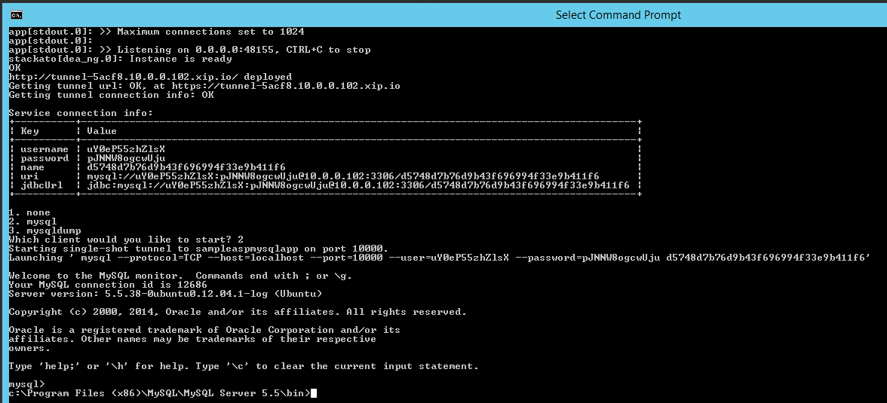

Usage and Deployment of the Windows Extensions for HP ALS
=========================================================


##Deployment

###Deploying stackato micro cloud

Full Documentation is available online on the stackato website: https://docs.stackato.com/admin/server/hpcs.html

- Create Security Group and add HTTP, HTTPS and SSH ingress rules
- Add Ingress Rule: All TCP ports; set the current security group as Remote
- Launch a "ActiveState Stackato v3.4.1" instance with 4GB of RAM (standard.medium)
- Associate floating IP to the newly created instance
- Login using ssh and rename the node: `kato node rename {floating_ip}.xip.io`

At this point, the web console should be available at {floating_ip}.xip.io

####Setup node in cluster mode

    kato node setup core
    kato role add dea

- add additional roles using `kato role add` (eg mysql, view available roles with `kato info`)

###Changes to the HP ALS installation

- on the stackato instance, edit /home/stackato/stackato/code/cloud_controller_ng/config/stacks.yml and add windows stack
```
default: "lucid64"
stacks: 
 - name: lucid64
   description: "Ubuntu 10.04 on x86-64"
 - name: windows2012r2
   description: "Windows 2012 R2"
```
- run `kato restart`

- [*optional*] Add the IIS8 buildpack to your ALS installation

      wget https://github.com/UhuruSoftware/uhuru-buildpack-iis8/archive/master.zip -O dotNet.zip
      stackato create-buildpack dotNet dotNet.zip


###Adding a Windows DEA to the cluster

On a Windows Server 2012 R2 enable IIS Web Server Role with all Role Services except WebDAV support.

1. The following features need to be available on the Windows server:
	
	- Windows Process Activation Service
		- Process Model
		- .NET Environment
		- Configuration APIs
	- .NET Framework Features
		- .NET Framework 3.5.1
		- .NET Framework 4.0
		- WCF Activation
			- HTTP Activation
			- Non-HTTP Activation      

2. Install Git following standard installation.

3. Install DEA using the DEAInstaller.msi; this will install the necessary files and create a windows service  
called WinDEA.
	

	- The installer can be used from the command line by using msiexec 
		
		<code>Sample call: msiexec /i c:\DEAInstaller.msi /qn messageBus="nats://192.168.1.109:4222/" baseDir="C:\droplets"  maxMemory="4000" /lvx! C:\\DEAInstaller.log ALLUSERS=2</code>

	- The following parameters can be used with the installer; it is **required** to set the MessageBus and Domain according to your configuration
	
			- MessageBus  		   
			- Domain	 
			- Index 	 		   -> default value: 0
			- BaseDir 			   -> default value: C:\droplets
			- LocalRoute 		   -> default value: 8.8.8.8
			- FilerPort   		   -> default value: 12345
			- StatusPort  		   -> default value: 0			 		   
			- MultiTenant 		   -> default value: true
			- MaxMemoryMB 		   -> default value: 4096
			- Secure			   -> default value: true
			- EnforceULimit 	   -> default value: true
			- HeartBeatIntervalMS  -> default value: 10000
			- AdvertiseIntervalMS  -> default value: 5000
			- UseDiskQuota		   -> default value: true
			- UploadThrottleBitsPS -> default value: 0
			- MaxConcurrentStarts  -> default value: 3
			- DirectoryServerPort  -> default value: 34567
			- StramingTimeoutMS	   -> default value: 60000
			- StagingEnabled	   -> default value: true
			- BuildpacksDirectory  -> default value: buildpacks
			- Git				   -> default value: C:\Program Files (x86)\Git\bin\git.exe
			- StagingTimeoutMS	   -> default value: 1200000
			- Stacks			   -> default value: iis8
			- INSTALLDIR		   -> default value C:\Program Files\Uhuru Software, Inc\Windows DEA\

  Default IIS8 buildpack will be **automatically** installed in the buildpacks folder of the target directory.

####The NATS URL

####Troubleshooting

#####Log files

##Usage

###IIS8 Buildpack

###Sample Applications

####Vanilla sample app with a MySQL Membership Provider

- Create the app yourself
	- From Visual Studio 2013 create an ASP.NET application, .Net Framework 4.5, when asked choose Web Forms
	
	
	- Install the MySQL connector nuget packages: MySql.ConnectorNET.Entity, MySql.ConnectorNET.Data, MySql.ConnectorNET.Web. It will update Web.config file
	
	
	- In Web.config change connectionStrings section. In this case "sampleaspmysqlapp" is the name of the mysql service that will be bind to the application in the stackato micro cloud. Choose whatever name you like and replace it in connectionStrings section. "DefaultConnection" is the name of the connection string, if you want to use another name, please note that you will have to change it manually also in Web.config membership section, "MySqlInitializer" class and "IdentityModel" class.	
	```
	<connectionStrings>
	  <add name="DefaultConnection" connectionString="Server={sampleaspmysqlapp#host};Database={sampleaspmysqlapp#name};Uid={sampleaspmysqlapp#user};Pwd={sampleaspmysqlapp#password};Port={sampleaspmysqlapp#port};pooling=false;" providerName="MySql.Data.MySqlClient" />
	</connectionStrings>
	```

	- In Web.config change membership section, if the name of the connection string is different replace "DefaultConnection" with your own name
	```
	<membership defaultProvider="MySQLMembershipProvider">
	  <providers>
	    <clear />
	    <add name="MySQLMembershipProvider"
	         type="MySql.Web.Security.MySQLMembershipProvider, MySql.Web, Version=6.8.3.0, Culture=neutral, PublicKeyToken=c5687fc88969c44d"
	         applicationName="/" description="MySQL default application"
	         connectionStringName="DefaultConnection" writeExceptionsToEventLog="False"
	         autogenerateschema="False" enableExpireCallback="False" enablePasswordRetrieval="False"
	         enablePasswordReset="True" requiresQuestionAndAnswer="True" requiresUniqueEmail="False" passwordFormat="Clear"
	         maxInvalidPasswordAttempts="5" minRequiredPasswordLength="7" minRequiredNonalphanumericCharacters="1"
	         passwordAttemptWindow="10" passwordStrengthRegularExpression="" />
	  </providers>
	</membership>
	```
	
	- In Web.config change Entity Framework and system data sections 
	```
	<entityFramework >
	  <providers>
	    <provider invariantName="MySql.Data.MySqlClient" type="MySql.Data.MySqlClient.MySqlProviderServices, MySql.Data.Entity.EF6">
	    </provider>
	  </providers>
	</entityFramework>
	<system.data>
	  <DbProviderFactories>
	    <remove invariant="MySql.Data.MySqlClient" />
	    <add name="MySQL Data Provider" invariant="MySql.Data.MySqlClient" description=".Net Framework Data Provider for MySQL" type="MySql.Data.MySqlClient.MySqlClientFactory, MySql.Data, Version=6.8.3.0, Culture=neutral, PublicKeyToken=c5687fc88969c44d" />
	  </DbProviderFactories>
	</system.data>
	```

	- Enable migrations: go to menu item View -> Other Windows -> Click on "Package Manager Console". Type `enable-migrations` in the console prompt and press enter. A new folder, Migrations containing a new file named "Configuration.cs" will be placed in the solution.
	
  
	- Under the Migration folder, add a new class named `MySqlHistoryContext.cs` and add the following code:

	```
    using System.Data.Common;
    using System.Data.Entity;
    using System.Data.Entity.Migrations.History;
    
    
    namespace SampleASPMySQLApp.Migrations
    {
    	public class MySqlHistoryContext : HistoryContext
    	{
    		public MySqlHistoryContext(DbConnection connection, string defaultSchema)
    			: base(connection, defaultSchema)
    		{
    
    		}
    
    		protected override void OnModelCreating(DbModelBuilder modelBuilder)
    		{
    			base.OnModelCreating(modelBuilder);
    			modelBuilder.Entity<HistoryRow>().Property(h => h.MigrationId).HasMaxLength(100).IsRequired();
    			modelBuilder.Entity<HistoryRow>().Property(h => h.ContextKey).HasMaxLength(200).IsRequired();
    		}
    	}
    }
	```

	- In the same migration folder, change Configuration.cs file to look like this:
	
	```
	namespace SampleASPMySQLApp.Migrations
	{
	    using System;
	    using System.Data.Entity;
	    using System.Data.Entity.Migrations;
	    using System.Linq;
	
	    internal sealed class Configuration : DbMigrationsConfiguration<SampleASPMySQLApp.Models.ApplicationDbContext>
	    {
	        public Configuration()
	        {
	            AutomaticMigrationsEnabled = false;
	
	            // register mysql code generator
	            SetSqlGenerator("MySql.Data.MySqlClient", new MySql.Data.Entity.MySqlMigrationSqlGenerator());
	
	            SetHistoryContextFactory("MySql.Data.MySqlClient", (conn, schema) => new MySqlHistoryContext(conn, schema));
	        }
	
	        protected override void Seed(SampleASPMySQLApp.Models.ApplicationDbContext context)
	        {
	
	        }
	    }
	}
	```
	- To create a new custom database initializer, add a new class file named `MySqlInitializer.cs` to the project, and change its code to the one below. If the name of the connection string is different replace "DefaultConnection" with your own name:
	```
	using SampleASPMySQLApp.Models;
	using System.Data.Entity;
	using System.Data.Entity.Infrastructure;
	using System.Linq;
	using MySql.Data.MySqlClient;
	
	namespace SampleASPMySQLApp
	{
	    public class MySqlInitializer : IDatabaseInitializer<ApplicationDbContext>
	    {
	        public void InitializeDatabase(ApplicationDbContext context)
	        {
	            string db = new MySqlConnectionStringBuilder(WebConfigurationManager.ConnectionStrings["DefaultConnection"].ConnectionString).Database;

            	// query to check if MigrationHistory table is present in the database
            	var migrationHistoryTableExists = ((IObjectContextAdapter)	context).ObjectContext.ExecuteStoreQuery<int>(
            		string.Format(
              		"SELECT COUNT(*) FROM information_schema.tables WHERE table_schema = '{0}' AND table_name = '__MigrationHistory'",
              		db));

            	bool dbMigrated = migrationHistoryTableExists.FirstOrDefault() != 0;

            	if (!dbMigrated)
            	{
                	// if MigrationHistory table is not there (which is the case first time we run) - create it
                	context.Database.Delete();
                	context.Database.Create();
            	}
	        }
	    }
	}
	```
	- In Models folder, change the `IdentityModel.cs` file code to look like this, the Helpers section remains the same. If the name of the connection string is different replace "DefaultConnection" with your own name:
	```
	using System;
	using System.Security.Claims;
	using System.Threading.Tasks;
	using System.Web;
	using Microsoft.AspNet.Identity;
	using Microsoft.AspNet.Identity.EntityFramework;
	using Microsoft.AspNet.Identity.Owin;
	using Microsoft.Owin.Security;
	using SampleASPMySQLApp.Models;
	
	namespace SampleASPMySQLApp.Models
	{
	    // You can add User data for the user by adding more properties to your User class, please visit http://go.microsoft.com/fwlink/?LinkID=317594 to learn more.
	    public class ApplicationUser : IdentityUser
	    {
	        public ClaimsIdentity GenerateUserIdentity(ApplicationUserManager manager)
	        {
	            // Note the authenticationType must match the one defined in CookieAuthenticationOptions.AuthenticationType
	            var userIdentity = manager.CreateIdentity(this, DefaultAuthenticationTypes.ApplicationCookie);
	            // Add custom user claims here
	            return userIdentity;
	        }
	
	        public Task<ClaimsIdentity> GenerateUserIdentityAsync(ApplicationUserManager manager)
	        {
	            return Task.FromResult(GenerateUserIdentity(manager));
	        }
	    }
	
	    public class ApplicationDbContext : IdentityDbContext<ApplicationUser>
	    {
	        public ApplicationDbContext()
	            : base("DefaultConnection", throwIfV1Schema: false)
	        {
	            System.Data.Entity.Database.SetInitializer(new MySqlInitializer());
	        }
	
	        public static ApplicationDbContext Create()
	        {
	            return new ApplicationDbContext();
	        }
	    }
	}
	```
	- Build and Start the app, go to Register page and create a new user and the message "Hello, user@example.com !" should be visible in the top right corner.
	 

- Now that the app is created, push it to stackato micro cloud:
	- Start stackato client and login to your stackato micro cloud deployment with windows DEA following the link: https://docs.stackato.com/user/quick-start/index.html
	- From command prompt go to the path where the application is, and type 
 	```
	stackato push --stack win2012
	```
when asked, choose default answer except when "Create services to bind to", choose "y". "What kind of service ?", choose 2, "Specify the name of the service" choose "sampleaspmysqlapp", or the name you specified in connection string settings in Web.config of the app. The command prompt should look something like this:
	
- To check that the mysql service is correctly created we open a tunnel:
	- From command prompt go to the path where mysql client is installed and type the code below where "sampleaspmysqlapp" is the name of the mysql service bound to the app
	```
	stackato tunnel sampleaspmysqlapp
	```
the tunnel application will be deployed, when asked "Which client would you like to start?" choose "2". The tunnel should be created and service connection info be displayed 
	 

- Download the app


####Umbraco

###Debugging your app

####Resource constraints

####Streaming log files

####Configuration files

- root web.config file
- applicationHost config file

# Windows DEA creation

## Using the evaluation VM available from cloudbase

You can download an evaluation VM offered by cloudbase from **http://www.cloudbase.it/ws2012r2/**

## Prerequisites for manual customization

>Install a linux distro with X server and the following packages:
	
	apt-get install -y qemu-kvm qemu-common virt-manager virt-viewer

	
	
>Create and run the following script :


 
     rm -rf win2012r2.qcow2
    
     [ ! -e virtio-win-0.1-81.iso ] && wget http://alt.fedoraproject.org/pub/alt/virtio-win/latest/images/virtio-win-0.1-81.iso
    
     qemu-img create -f raw win2012r2.raw 10G
     
     virsh destroy win2012r2
     virsh undefine win2012r2
     
     virt-install --connect qemu:///system \
       --name win2012r2 --ram 2048 --vcpus 2 \
       --network network=default,model=virtio \
       --disk path=/home/uhuru/win2012r2/win2012r2.raw,device=disk,bus=virtio \
       --cdrom /home/uhuru/win2012r2/en_windows_server_2012_r2_x64_dvd_2707946.iso \
       --disk path=/home/uhuru/win2012r2/virtio-win-0.1-81.iso,device=cdrom \
       --vnc --os-type windows --os-variant win7 \
       --force
    

## Windows installation

>Enable the VirtIO drivers.
	
The disk is not detected by default by the Windows installer. When requested to choose an installation target, click Load driver and browse the file system to select the E:\WIN8\AMD64 folder. The Windows installer displays a list of drivers to install. Select the VirtIO SCSI and network drivers, and continue the installation.

>Open a terminal and install all drivers :

	pnputil -i -a E:\WIN8\AMD64\*.INF

>Download and install CloudBase-Init (in the same terminal)

     powershell
     
     Set-ExecutionPolicy Unrestricted
     
     Invoke-WebRequest -UseBasicParsing http://www.cloudbase.it/downloads/CloudbaseInitSetup_Beta_x64.msi -OutFile cloudbaseinit.msi
     
     .\cloudbaseinit.msi
    
In the configuration options window, change the following settings:

Username: *Administrator*

Network adapter to configure: *Red Hat VirtIO Ethernet Adapter*

Serial port for logging: *COM1*

When the installation is done, in the Complete the Cloudbase-Init Setup Wizard window, select the Run Sysprep and Shutdown check boxes and click Finish.

Wait for the machine shutdown.

> Upload the image using glance

	glance image-create --name WS2012 --disk-format qcow2 --container-format bare --is-public true --file ws2012.qcow2