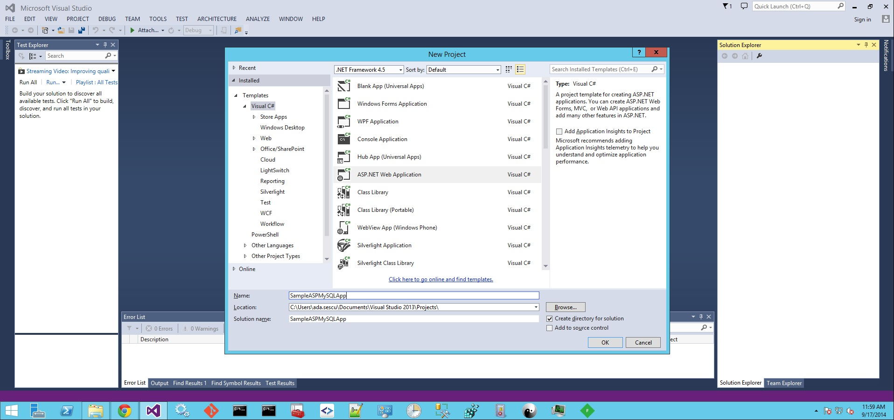
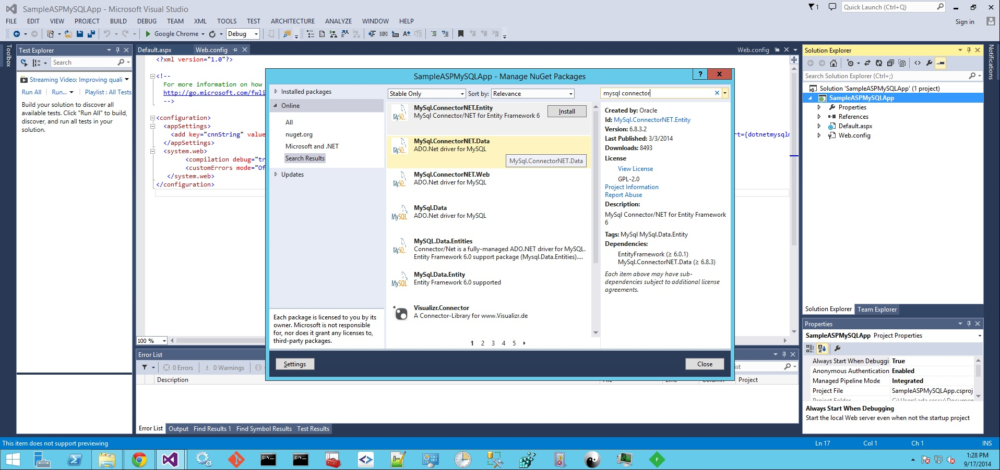
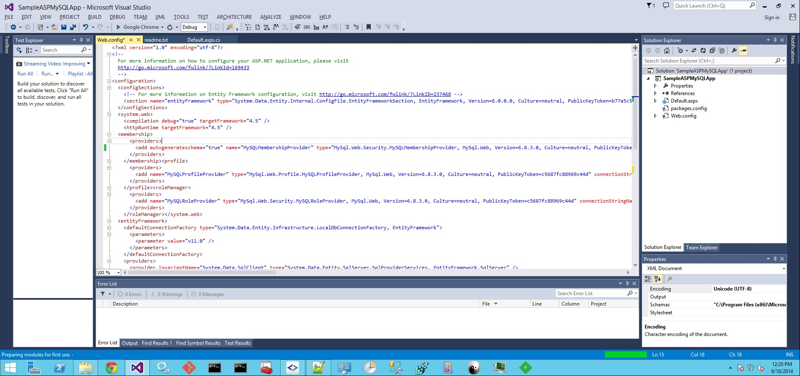
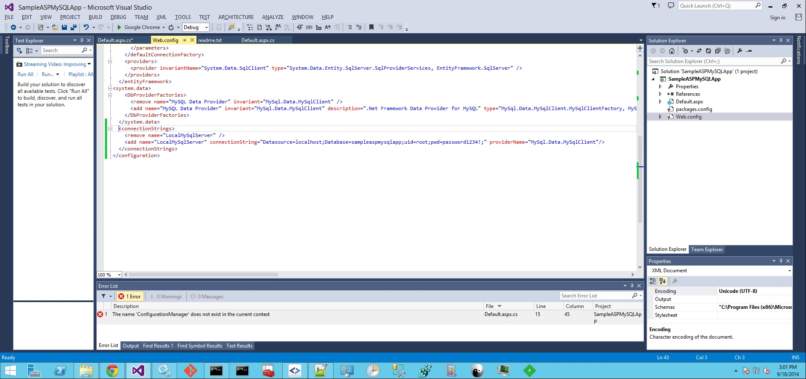

Usage and Deployment of the Windows Extensions for HP ALS
=========================================================

##Deployment

###Changes to the HP ALS installation

- [*optional*] Add the IIS8 buildpack to your ALS installation

      wget https://github.com/UhuruSoftware/uhuru-buildpack-iis8/archive/master.zip -O dotNet.zip
      stackato create-buildpack dotNet dotNet.zip

###Adding a Windows DEA to the cluster

####The NATS URL

####Troubleshooting

#####Log files

##Usage

###IIS8 Buildpack

###Sample Applications

####Vanilla sample app with a MySQL Membership Provider

- Create the app yourself
	- From Visual Studio 2013 create an empty ASP.NET application
	
	- Install the MySQL connector nuget packages: MySql.ConnectorNET.Entity, MySql.ConnectorNET.Data, MySql.ConnectorNET.Web
	
	- In web.config, add autogenerateschema="true" in membership provider MySQLMembershipProvider section
	
	- In web.config add connectionStrings section
	
- Download the app

####Umbraco

###Debugging your app

####Resource constraints

####Streaming log files

####Configuration files

- root web.config file
- applicationHost config file

